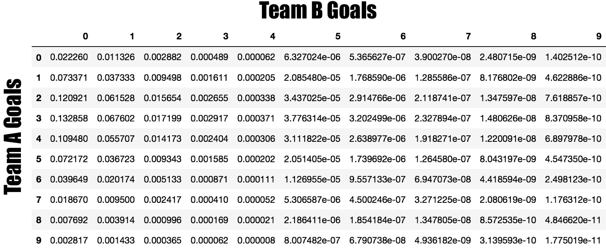
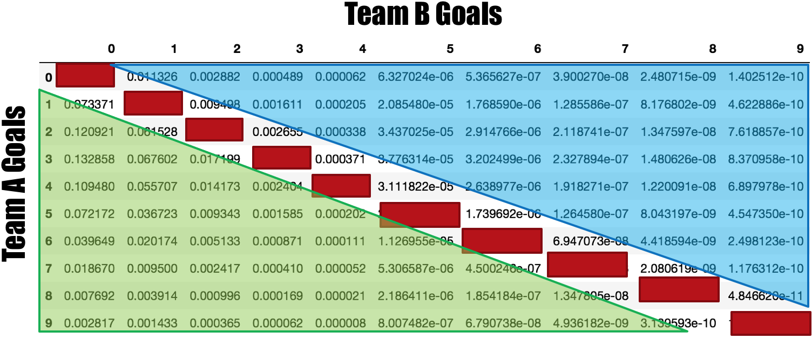
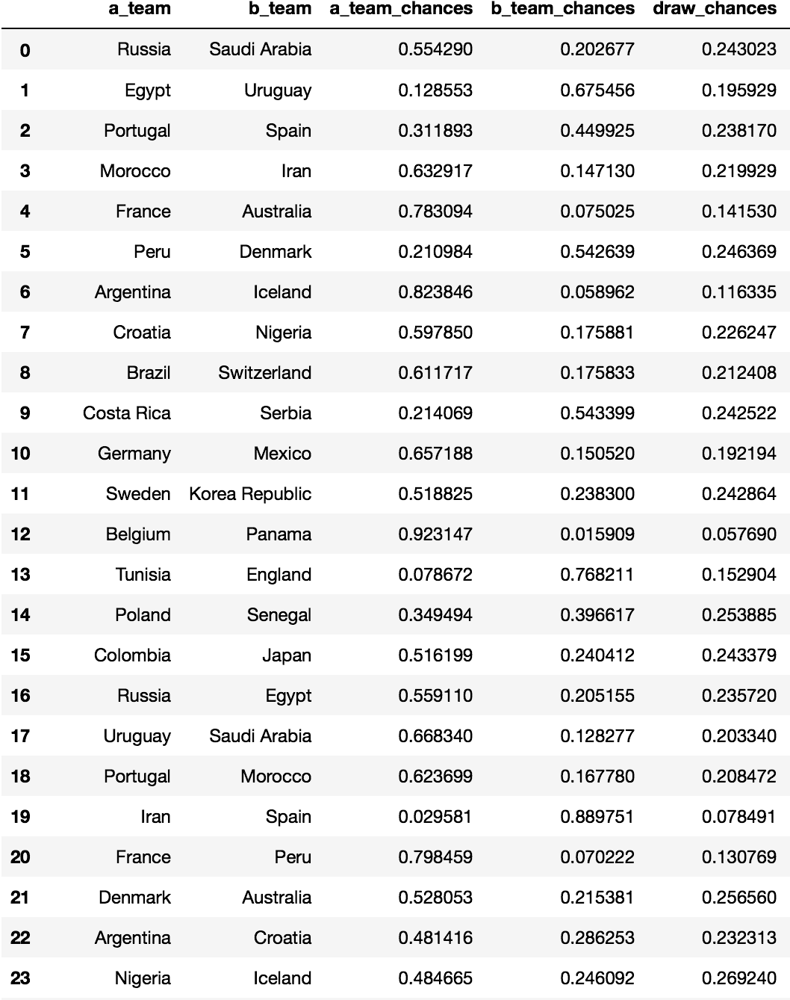
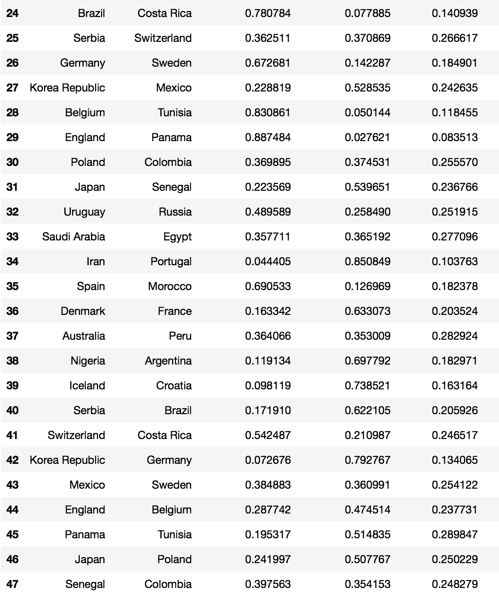

# Can the 2018 FIFA World Cup be predicted using video game data?

The goal of this project is to see if its possible to use player level data from the FIFA 18 video game to build a reasonable model for predicting outcomes of soccer matches. From there, use the model to determine each country's chances of being crowned champion.

## Main Questions
- Which statistical model would be most appropriate for modeling soccer games?
- What is the probability that each team would win the world cup?

## Datasets
- Player ratings from the FIFA 18 Video Game
    - 18,000 players
    - 70 datapoints per player
- 2017-2018 Season results for training the model from:
    - English Premiere League
    - German Bundesliga
    - Spanish La Liga
    - Italian Serie A
    - 1500 total matches
- World Cup 2018 match schedule

## Poisson Modeling Approach
Open the Juptyer Notebook to see all the python code and run the model yourself:
[https://github.com/MikeStrenk/Modeling-the-World-Cup-2018/blob/master/worldcup2018_predictions.ipynb]

The Poisson distribution model was chosen because the odds of a soccer goal does not depend on how much time has passed since the previous goal. The Poisson distribution models the probability of events happening 'n' number of times within a set time frame. Those events in our case is each country's goals.

The Poisson model takes team ratings as the input. These team scores are generated from the individual strength of each of the team's players separated by attacking, midfield and defensive players. The model is trained using roughly 1500 Club matches from the 2017-2018 season from the four main european club leagues.

The output from the Poisson distribution model is an array of probabilities of each possible goal result between the two teams.

The overall probability of a draw is the sum of the red diagonal values. Team A's odds of a win is the sum of the values below the diagonal (shown in green). Team B, respectively, is the sum of the upper triangle.

## Group Stage Probabilities

## Results After Running the World Cup Simulation 1000 times
Since the simulation takes into account alternate potential paths to the finals based on different group stage outcomes, it is interesting to see that some teams end up closer to the top than stronger teams who have far tougher early matches (see Portugal, Spain). Croatia and Mexico are less likely to play a stronger team early in the Cup schedule so they tended to advance more often than one might expect.

- Argentina 127
- Belgium 88
- Germany 87
- England 86
- Croatia 73
- Mexico 60
- Sweden 57
- Uruguay 56
- Portugal 54
- Colombia 54
- Spain 43
- Morocco 33
- Egypt 23
- Japan 23
- Russia 23
- Brazil 23
- Iceland 16
- France 14
- Nigeria 12
- Poland 9
- Senegal 8
- Korea Republic 7
- Saudi Arabia 6
- Denmark 5
- Serbia 4
- Peru 4
- Iran 3
- Costa Rica 2
